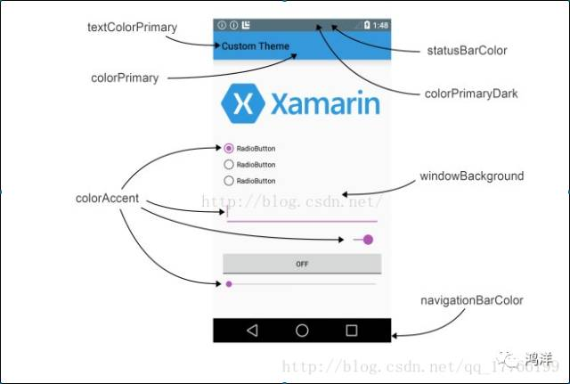

###EditText自定义样式
1. 修改光标颜色
android:textCursorDrawable="XXX"

```
<shape xmlns:android="http://schemas.android.com/apk/res/android" 
android:shape="rectangle"
>
  <solid android:color="#9bd435"/>
  <size android:width="2dp"/>

</shape>

```

2.修改选中图标
```
android:textSelectHandleLeft="@drawable/cursor"//选中图标左边
android:textSelectHandleRight="@drawable/right"//选中图标右边
android:backgroundTint="#9bd435"     <!--下划线颜色-->
android:textColorHighlight="#9bd435" <!--选中文字背景色-->

```

3.通过主题改变样式
Material Design 各个属性


```
<style name="AppTheme" parent="Theme.AppCompat.Light.NoActionBar">
       <item name="colorAccent">#9bd435</item>
</style>
```
效果
![image/效果图.jpg]
